# mysql基础

## mysql安装 （重点）

1. ubuntu 

	```
	sudo apt-get install mysql-server
	```
2. macos

	下载dmg软件包,直接双击安装,然后在设置里面去启动

3. ubuntu启动mysql并且查看Mysql的状态

	```
	canvas@ubuntu:/etc/apt$ service mysql start
	canvas@ubuntu:/etc/apt$ service mysql status
	● mysql.service - MySQL Community Server
	   Loaded: loaded (/lib/systemd/system/mysql.service; enabled; vendor preset: enable
	   Active: active (running) since Thu 2018-09-20 06:14:57 PDT; 12min ago
	 Main PID: 13050 (mysqld)
	    Tasks: 28 (limit: 1085)
	   CGroup: /system.slice/mysql.service
	           └─13050 /usr/sbin/mysqld
	
	Sep 20 06:14:56 ubuntu systemd[1]: Starting MySQL Community Server...
	Sep 20 06:14:57 ubuntu systemd[1]: Started MySQL Community Server.

	```
	
## mysql连接工具

1. navicat 连接mysql

	说明: navicat是一个强大的mysql图形化界面客户端
	
2. mycli 连接Mysql

	说明: mycli是一个python写的mysql客户端工具,它带有命令自动补全,部分错误命令自动纠正的功能
	
	安装:
	
	```
	canvas@ubuntu:/etc/apt$ sudo apt-get update
	```

## mysql 连接配置 （重点）

客户端连接的mysql服务器

	```
	canvas@ubuntu:/etc/apt$ mycli -u root -h localhost -P3306
	```	
	
## mysql 层级 （重点）

1. mysql有三个层级

	1. 库   database
	
		一个mysql服务器程序中可以有很多的库,一个数据库就可以表示一个完整的网站或者应用里面要用到的所有数据库,但是mysql服务中可以同时有很多库
		
		
	2. 表   table

		一个表可以表示一个实例的数据,比如表示一个班级的信息或者表示一个人的信息,表存在于库中
	 
	3. 字段   columns

		字段是表里面具体的数据,比如一个表可以表示一个人的信息,那么一个字段可以表示这个人的年龄

## mysql权限配置 （一般）

1. 登录权限

	1. 给root 在 127.0.0.1的ip上面登录的授予所有库所有表所有权限
	
	    ```
	    grant all privileges on *.* to root@127.0.0.1 identified by "123456"
	    ```
	    >创建新用户(如果没有)，用户名为canvas，密码为123456 ；只能在本地访问
	    
	2. 给root用户在所有ip上面登录的可以操作所有库和所有表
	
		```
		grant all privileges on *.* to canvas@“%” identified by "123456"
		```　　
	>创建新用户(如果没有)，用户名为canvas，密码为123456 ； 所有的ip都可以访问
	
	3. 给 canvas用户在 10.2.xxxip登录的地址授予所有的权限
	
		```
		grant all privileges on *.* to canvas@“10.2.%” identified by "123456"
		```
	>创建新用户(如果没有)，用户名为canvas，密码为123456;
	
	4. flush privileges 设置完成后刷新权限

2. 设置用户访问数据库权限

	1. ```grant all privileges on mysql_teaching.* to canvas1@localhost identified by “1234567890”```
	  >设置用户canvas1 可以访问mysql_teaching库的所有数据 ；
	
	2. ```grant all privileges on mysql_teaching.account to canvas2@localhost identified by “1234567890”```
	>设置用户canvas1 可以访问mysql_teaching库account表的所有数据;
	
3. 设置用户操作权限

    1. canvas3用户只有读权限
    
	　　```grant select  on mysql_teaching.account to canvas3@localhost identified by “1234567890” ```
　　

	2. canvas3用户只有读权限，插入
	
		```grant select，insert  on mysql_teaching.account to canvas3@localhost identified by “1234567890” ```


    3. 其他权限 update，delete

## 建库建表 （一般）

1. 库操作

	1. 创建数据库
	
		```
		CREATE DATABASE `test_base` DEFAULT CHARACTER SET utf8mb4 COLLATE utf8mb4_general_ci;
		```
		>utf8mb4代表使用的字符集编码方式为utf8mb4,ut8mb4比起utf8字符集多了表情包的字符集合编码方式,是utf8的超集。 后utf8mb4\_general\_ci表示数据库在搜索的时候不会区分大小写

    2. 查看数据库
        ```
        show databases;
        ```
    3. 删除数据库
    
        ```drop database `test_base`;```
        
    4. 使用xx数据库

	    ```use test_base```;

2. 表操作

    1. 创建表
		
		每一个数据列都有一个名字和一个类型，而每一种类型又都关联有一些属性。数据列的声明语法如下所示：
		
		```
		col_name col_type [type_attributes] [general_attributes]
		```
		
        ```create table t1( id INT(10), name CHAR(10) NOT NULL DEFAULT 'xiaoming');```
        
        上面表示name值插入的时候不能为空,如果没有设置值,那么他会默认生成一个'xiaoming的字符'
        
    2. 查看当前库中的所有表 
    
        ```show tables;```
        
    3. 删除表   
    
        ```drop table t1;```
        
    4. 查询数据
    
        ```select * from tutorials_tbl;```
        
## 主键 外键 （重要）

1. 主键

	1. 概述
	
		表中的每一行都应该具有可以唯一标识自己的一列(或一组列)。而这个承担标识作用的列称为主键。如果没有主键，数据的管理将会十分混乱。比如会存在多条一模一样的记录，删除和修改特定行十分困难。
		
		任何列都可以作为主键，只要它满足以下条件：
		
		   1. 任何两行都不具有相同的主键值。就是说这列的值都是互不相同的。
		   
          2. 每个行都必须具有一个主键值。主键列不允许设置为NULL。
          3. 主键列的值不建议进行修改和更新。

    2. 声明主键的方法

    	```
    	
    	CREATE TABLE t1(
		   id int not null primary key,
		   name char(20)
		);
    	
    	```
    	
    	```
    	
    	create table dd(  
	    id int primary key not null auto_increment,  
	    name varchar(20),  
	    time timestamp default current_timestamp  
	    );  
    	
    	```
		
2. 外键

	1. 概念
	
		如果一张表中有一个非主键的字段指向了别一张表中的主键，就将该字段叫做外键
		
	2. 外键的作用

		1. 对子表(外键所在的表)的作用：子表在进行写操作的时候，如果外键字段在父表中找不到对应的匹配，操作就会失败。
		2. 对父表的作用：对父表的主键字段进行删和改时，如果对应的主键在子表中被引用，操作就会失败。

		
	3. 外键的定制作用----三种约束模式：

<!--		1. district：严格模式(默认), 父表不能删除或更新一个被子表引用的记录。-->

     1. cascade：级联模式, 父表操作后，子表关联的数据也跟着一起操作。

　　　2. set null：置空模式,前提外键字段允许为NLL,  父表操作后，子表对应的字段被置空。

　   3. no action: 如果有外键存在,主键是不能被删除的

## 字段类型

#### 1. 数值数据类型

1. 说明:

    MySQL的数值数据类型分为3大类:
    
       1. 精确值类型，它包括整数类型和DECIMAL
				
           1. 整数类型用来存放没有小数部分的数值，如43、-3、0、-798432等。
           2. DECIMAL类型保存的精确值可以有一个小数部分，如3.14159、-.00273、-4.78等。这种数据类型非常适合用来保存财务金额数据。只要有可能，进入数据库的整数和DECIMAL值就会和你录入的完全一样，不存在四舍五入的问题，用它们进行的计算也是精确的。

           
       2. 浮点类型,它细分为单精度（FLOAT）和双精度（DOUBLE）。这些类型和DECIMAL类型一样，也可以用来存放有小数部分的数值，但它们容纳的是可能发生四舍五入的近似值.如果对数值精确度的要求不那么严格或是数值大到DECIMAL类型无法表示，浮点类型会是不错的选择。
           
           

       	
       3. BIT类型

       	用来保存位字段值（bit-field value）
 
2. 字段取值范围和占用磁盘空间

	 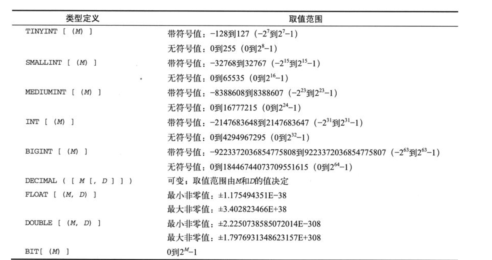
	 
	 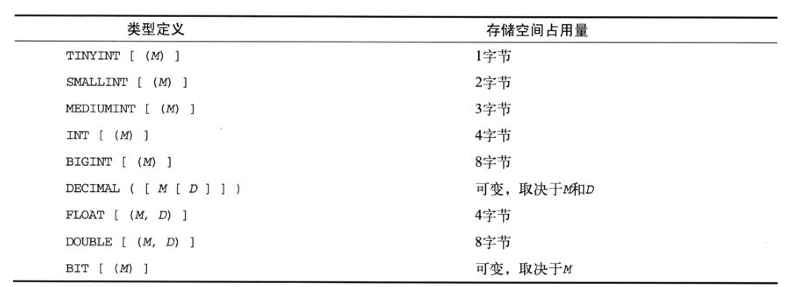
	 
3. 说明:
	1. 前面建表语句中int(10)不是Int值的大小,而是改字段的显示大小，他和存储大小和能存储的最大值是没有关系的 ```create table t1( id INT(10), name CHAR(10) NOT NULL DEFAULT 'xiaoming');```
	2. DECIMAL
	
	    1. DECIMAL数据列也可以被定义成UNSIGNED。与整数类型不同的是，把一个DECIMAL类型的数据列定义为UNSIGNED不会扩大该数据列的取值范围，其效果只是“砍掉”整个负数部分而已。
	    2. 对于DECIMAL数据列，你可以给出一个有效数字的最大个数M和一个小数部分数字个数D。它们分别对应于“精度”和“小数位数”概念，这些概念应该是你比较熟悉的。M的取值范围是从1到65，D的取值范围是从0到30且不得大于M
	    3. M和D都是可选的。如果省略了D，它的默认值将是0。如果省略了M，它的默认值将是10。

	    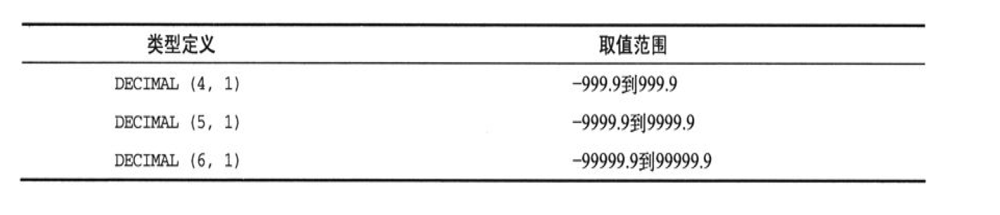
	    
	3. 近似值数值数据类型

		1. MySQL提供了FLOAT和DOUBLE两种浮点类型来保存近似值，你可以给浮点类型加上UNSIGNED属性声明，这将把浮点类型的负数部分去掉。
		2. 你可以给浮点类型设定一个有效数字的最大个数M和一个小数部分数字个数D（就像对待DECIMAL类型那样）。M是一个1到255之间的整数值，D是一个0到30之间的整数值且不能大于M。
		3. 对于FLOAT和DOUBLE类型，M和D都是可选的。如果在定义数据列时省略了它们，MySQL将按你的硬件所能允许的最大精度来存储该数据列的值。
	
	4. UNSIGNED属性不允许数据列里出现负数值

4. 在为数值数据列挑选数据类型时，你需要考虑数据的取值范围并挑选一个能够覆盖该范围的最小类型来使用。选择较大的类型会浪费存储空间，毫无必要地使数据表变得很大，会降低数据的处理效率

5. 数值截断

    1. 每个数值数据列的取值范围是由它的类型决定的。如果你试图把一个超出某数据列取值范围的值插入该数据列，结果将取决于是否已启用严格SQL模式。如果已启用，超出取值范围的值将导致一个错误；如果未启用严格模式，MySQL将截短这个值，MySQL会先把这个值替换为该数据列取值范围的上限值或下限值后再进行插入，同时生成一条警告消息。
    2. 一个声明为SMALLINT(3)类型的数据列的显示宽度只有3个字符，但它的取值范围却是从-32768到32767。如果你想把值12345插入到这个数据列里，那么，因为12345虽然要比这个数据列的显示宽度更长，但仍落在该数据列的取值范围内，所以插入操作不会出现截短处理，这个值仍将以12345的形式被插入和检索。可值99999就不同了，它超出了这个数据列的取值范围，所以它在插入时将被截短为32767，以后的检索操作所查到的结果也将是32767。

#### 字符串类型 (重要)

1. 数据类型

    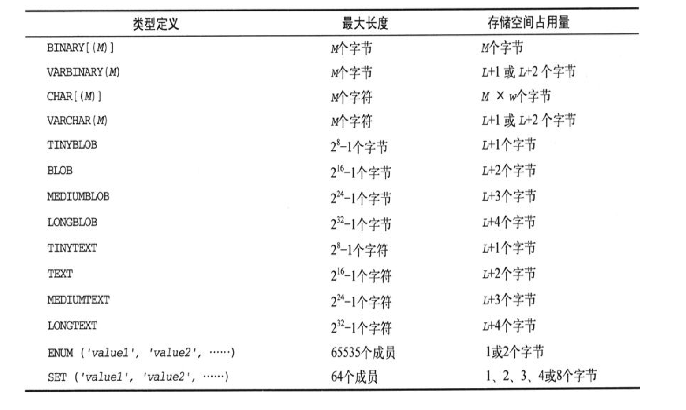
    
    有些类型用来保存二进制字符串（字节串），其他类型用来保存非二进制字符串。因此，表3-10里列出的最大尺寸对二进制字符串类型来说是字节数，对非二进制字符串来说是字符数。比如说，BINARY(20)容纳20个字节，而CHAR(20)容纳20个字符（由多字节字符构成的字符串的长度肯定会超过20个字节）。
    
    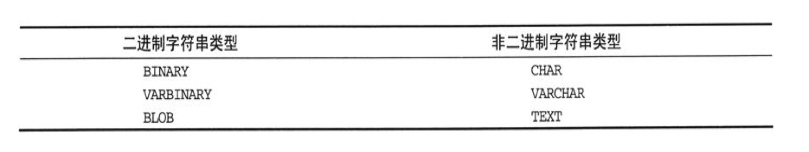
    
 2. 长度和存储空间关系

     1. 定长

         BINARY和CHAR是固定长度的字符串类型。对于这两种类型的数据列，MySQL将为每个值分配同样数量的存储空间，如果某个值比数据列的长度短，则在其尾部添加一些零值字节（0x00，BINARY类型）或空格（CHAR类型）以补足之。因为CHAR(M)数据列必须能够容纳由相关字符集里最宽的字符构成的字符串，所以该数据列需要占用M×W个字节，W是字符集里最宽的字符所占用的字节数。比如说，ujis字符集里的每个字符需要占用1到3个字节，所以CHAR(20)必须分配60个字节以应对那20个字符全都需要占用3个字节的情况。
         
     
     2. 变长

     		其他的字符串类型都是可变长度的，每个值占用的存储空间会随着数据行的不同而不同，并取决于实际存放到数据列里的值的长度。对于可变长度的类型，这个长度在上表里用L来代表。在L的基础上多出来的额外字节是用来保存有关数据的长度所必须的字节数。

	  3. 数据截断

	      除ENUM和SET类型以外，所有字符串类型的值都存储为一串连续的字节，MySQL将根据该类型容纳的是二进制字符串还是非二进制字符串把那些字节序列解释为一系列字节或一系列字符。如果数据值的长度超出了它们的表示范围，MySQL将自动对有关数据进行截短处理。
	      
	  
 	
3. CHAR和VARCHAR数据类型

	1. CHAR和VARCHAR字符串类型用来保存非二进制字符串，因而与一种字符集和排序方式相关联。
	2. CHAR和VARCHAR数据类型的主要区别在于它们的长度是固定的还是可变的，CHAR是一种固定长度的类型，而VARCHAR是一种长度可变的类型。
	3. 在定义CHAR数据列时，你可以把它的最大长度M定义为1到255之间的一个整数。CHAR类型中的M是可选的，如果省略，它的默认值是1。请注意，CHAR(0)是合法的，如果你允许它为NULL值，你还可以用它来表示on/off开关值。这种数据列只有两种可取值：NULL值或空字符串。在数据表里，CHAR(0)数据列只占用非常少的空间——只占用一位。
	4. 对VARCHAR(M)数据列而言，M在语义上的取值范围是1到65535，但它实际能够容纳的最大字符个数肯定小于65535——这是因为MySQL数据表里的每个数据行的最大长度只有65535个字节。

4. BLOB和TEXT数据类型

    1. BLOB是英文binary large object（二进制大对象）的字头缩写，其基本含义是指一个能够用来盛放任何东西的容器，而且是你想让它有多大，它就有多大。MySQL里的BLOB类型其实是一个由TINYBLOB、BLOB、MEDIUMBLOB和LONGBLOB等类型组成的大家庭。除各自所能容纳的最大信息量不同以外，它们在其他方面完全相同。BLOB数据列存储的是二进制字符串，如果你想保存的信息有可能急剧膨胀到非常大的地步，或者各数据行的长短差异很大，就很适合用BLOB数据列来存放。压缩数据、加密数据、图像和声音都是很好的例子。

    2. MySQL还有一个由TINYTEXT、TEXT、MEDIUMTEXT和LONGTEXT等类型组成的TEXT家族，它们和相应的BLOB类型有很多相似之处，但TEXT类型存储的是非二进制字符串而不是二进制字符串。换句话说，它们存储的是字符而不是字节，


5. 字符串数据类型的属性

	1. 字符串数据类型特有的属性是CHARACTER SET（或CHARSET）和COLLATE，它们分别用来指定一种字符集和一种排序方式。

	2. CHARACTER SET和COLLATION属性适用于CHAR、VARCHAR、TEXT、ENUM和SET数据类型，但不适用于二进制字符串数据类型（BINARY、VARBINARY和BLOB），因为那些类型的内容是一些字节串，而不是一些字符串。
	3. 使用规则:
	    1. 你打算使用的字符集必须是MySQL支持的。SHOW CHARACTER SET语句可以查出当前可用的字符集都有哪些。
	    2. 如果在定义里同时使用了CHARACTER SET和COLLATION属性，它们所代表的字符集和排序方式必须是兼容的。比如说，如果字符集是latin2，你可以使用latin2_croatian_ci排序方式，但不能使用latin1_bin排序方式。SHOW COLLATION语句可以把每一种字符集支持的排序方式列出来。
	    3. 如果在定义某个数据列时只给出了CHARACTER SET属性，而没有给出COLLATION属性，该数据列将使用默认排序方式。
	        1. 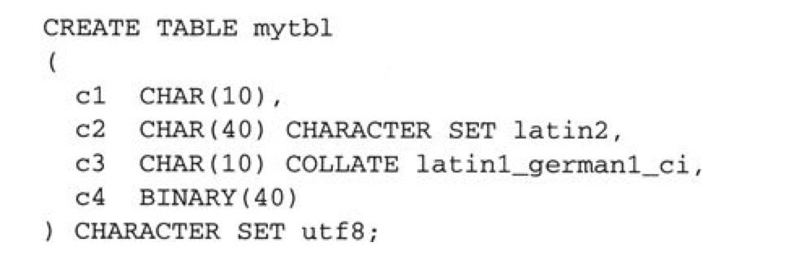
	        
	        2. 查找方式
	        
	            1. 如果数据列的定义里指定了一个字符集，就使用这个字符集。（包括只给出了COLLATON属性的情况，因为MySQL可以根据排序方式的名字确定应该使用哪一种字符集。）

               2. 否则，如果数据表的定义里有一个数据表级的字符集选项，就使用那个字符集。

               3. 否则，使用数据库的字符集作为数据表的默认字符集，该字符集还将成为数据列的默认字符集。如果以前没有为数据库明确地指定过一个字符集（比如说，用MySQL 4.1以前的版本创建的数据库就是这样），数据库的字符集将沿用服务器的字符集。
               
           
           3. collate
               https://blog.csdn.net/woshinannan741/article/details/49077751
               
6. 日期/时间数据类型

	1. 说明:MySQL提供的日期/时间数据类型有以下几种：DATE、TIME、DATETIME、TIMESTAMP和YEAR。

	     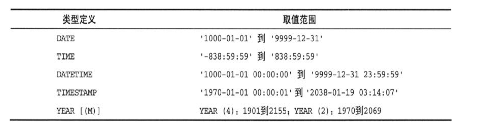
	     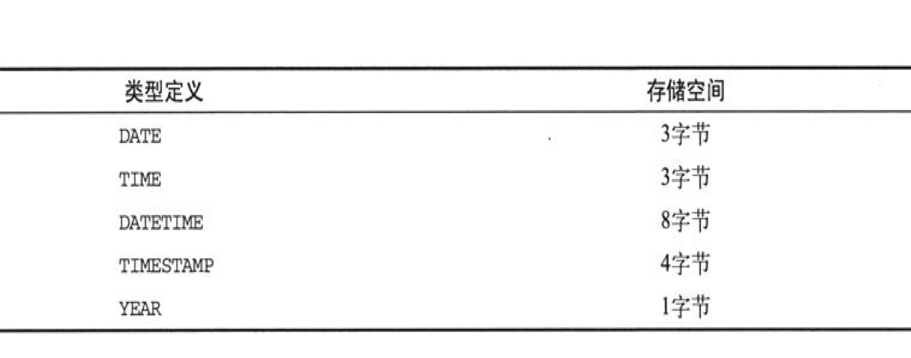
	     
	     对于日期加时间形式的组合值，可以在日期和时间之间使用字母“T”来代替空格作为分隔符（例如，'2008-12-3T12:00:00'）。
	     
	2. DATE、TIME和DATATIME数据类型

		DATE和TIME类型分别用来保存日期值和时间值，DATATIME类型用来保存日期和时间的组合值。这3种类型的格式分别是'CCYY-MM-DD'、'hh:mm:ss'和'CCYY-MM-DD hh:mm:ss'，其中的CC、YY、MM、DD、hh、mm、ss分别代表世纪、年、月、日、时、分、秒。
		
		
		
	3. TIMESTAMP数据类型

		1. TIMESTAMP数据类型用来保存日期和时间的组合值
		2. TIMESTAMP值以UTC（Universal Coordinated Time，世界标准时间）格式存放。当你保存一个TIMESTAMP值的时候，服务器会把它从连接的时区转换为UTC时间值。当你以后检索这个值的时候，服务器又会把它从UTC时间值转换回连接的时区，让你看到的时间值和你存储的一样。不过，如果另一个客户使用另一个时区去连接服务器并检索这个值，它将看到按照它自己的时区转换而来的值。事实上，只要在你自己的连接里改变了时区设置，就可以看到这样的效果：
		    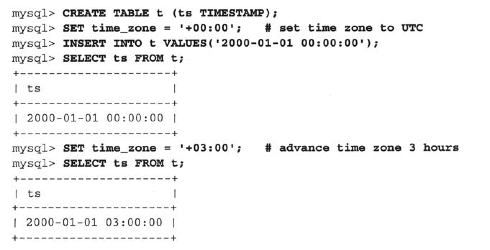
	
	4. 3．YEAR数据类型

		YEAR是一种单字节的数据类型，既能节约存储空间，又能提高处理效率，非常适用于只会用到年份值的场合。在声明YEAR数据列时，可以为它设定一个显示宽度M，只能是4或2。如果没有在YEAR数据列的声明定义里对M值进行设定，其默认值将是4。YEAR(4)的取值范围是1901年到2055年；YEAR(2)的取值范围是1970年到2069年，但只显示最后两位数字。如果你只需用到日期值里的年份数字，比如出生年份、公司创建年份等，就应该使用YEAR类型。如果只需要年份值，在各种日期/时间类型中，YEAR类型的存储空间占用量是最小的。
		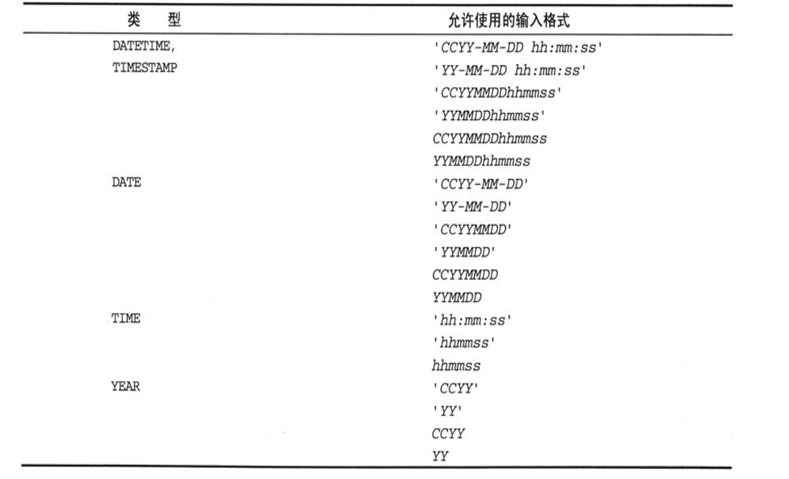


#### 序列 (了解)

1. 说明:很多应用都需要使用一些独一无二的编号来作为标识，如会员号、抽样编号、顾客编号、程序漏洞报告或故障报告表编号等。MySQL这种独一无二的编号机制是通过数据列的AUTO_INCREMENT属性而自动生成一组序列编号的办法来实现的.
2. AUTO_INCREMENT属性

	1. AUTO_INCREMENT数据列必须按照以下条件定义

		1. 每个数据表只能有一个数据列具备AUTO_INCREMENT属性，而且它应该有一种整数数据类型。（AUTO_INCREMENT也支持浮点类型的数据列，但需要那么做的情况极少。）
		2. 必须给该数据列添加索引。使用一个PRIMARY KEY或UNIQUE索引的情况最常见，但使用一个非唯一索引的情况也是允许的。
		3. 必须给该数据列添加一个NOT NULL约束条件。即使你没有明确地做出这样的声明，MySQL也会自动地把该数据列设置为NOT NULL。
		4. 把NULL值插入一个AUTO_INCREMENT数据列将使MySQL自动生成下一个序列编号并把该值插入该数据列

			   1. AUTO_INCREMENT序列通常从1开始依次单步递增，这意味着连续插入某个数据表的数据行的序号值将是1、2、3，等等。在某些场合，根据具体使用的存储引擎，可以明确地对下一个序号进行设置或重新设置，或者是重复使用已经从序列顶端被删除的序号值。


## 表达式编写 (了解)

1. 概述:

	1. 表达式可以简单到只是一个常数，例如数值0和字符串'abc'。
	2. 表达式里允许出现函数调用。有些函数带有输入参数（即括号里的值），有些则不带。如果某个函数的输入参数多于一个，就要用逗号把它们分隔开。在调用内置函数时，它的输入参数之间允许出现空格。但函数名与紧随其后的左括号之间则不允许出现空格，因为常会出现语法错误。不过，如果你使用了IGNORE_SPACE，MySQL就会允许内置函数名的后面出现空格，但它会把函数名全都视为保留字。
	3. 表达式里还允许出现数据列引用。在最简单的场合，即MySQL能够根据上下文清楚地知道某个数据列属于哪个表时，你可以只给出该数据列的名字。

	    ```
	    SELECT test2 from test1
	    ```
	    
	4. 如果MySQL无法根据数据列的名字把它们区分开来，就必须在数据列名字的前面加上它所在的数据表的名字作为限定。如果MySQL无法确定数据表属于哪一个数据库，就必须在数据表名字的前面加上它所在的数据库的名字作为限定。即使在不会导致歧义的场合，你也可以采用这种更为具体明确的形式来书写表达式。如下所示：

		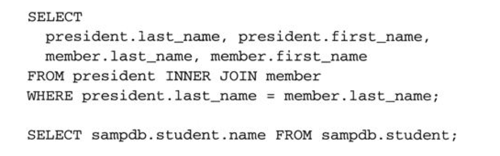
		
	5. 标量子查询可以在表达式里用来提供单个的值。这样的子查询必须用括号括起来：

		``` SELECT test2 from test1 where test1=(select max(test1) from test1)```
		
2. 操作符 

	1. 概述: 算术操作符包括常见的加法操作符、减法操作符、乘法操作符、除法操作符和求余操作符。两个操作数都是整数的运算，将使用BIGINT（64位）整数值来进行。如果两个操作数都是整数，只要其中一个操作符是无符号的，结果就将是无符号的。对于除DIV以外的每个操作符，只要有一个操作数是一个近似值，就会按双精度浮点运算规则进行计算。从字符串转换而来的数值也适用这一原则，因为字符串总是被转换为双精度数值。要特别注意在整数运算中可能出现的超大数值。比如说，如果计算结果超过64位，得到的结果将不可预测。（事实上，应该尽量避免使用超过63位的整数，因为正负号也要占用一位。）

	2. 算术操作符运算

		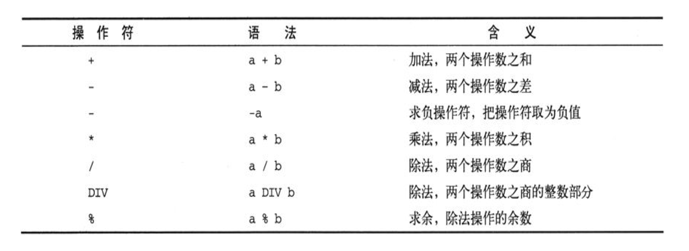
		
	3. 逻辑操作符运算

		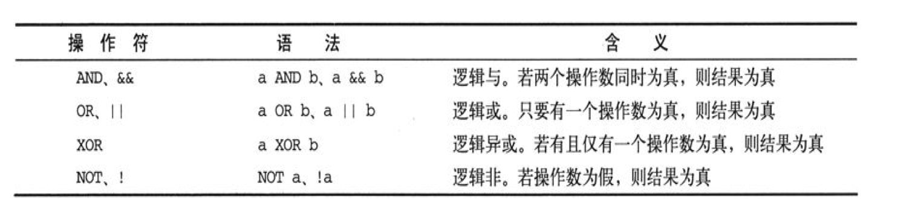
		
		作为AND、OR和NOT操作符的替代品，MySQL还支持&&、||和！操作符，它们的用法和在C语言中一样。请特别注意||操作符。SQL语言标准把||规定为字符串拼接操作符，但它在MySQL里完成却的是逻辑“或”操作。如果打算用如下所示的表达式来拼接字符串，就会惊讶地发现其返回结果是数值0：
		
		``` 
		'abc' || 'def'
		```
		
		之所以会发生这样的事情，是因为'abc'和'def'将被转换为整数以进行逻辑“或”操作，而这两个字符串的转换结果都是0。在MySQL里，你必须使用CONCAT('abc', 'def')或其他办法来拼接字符串，如下所示：
		
		```
		CONCAT('abc', 'def')
		```
		
	4. 比较操作符

		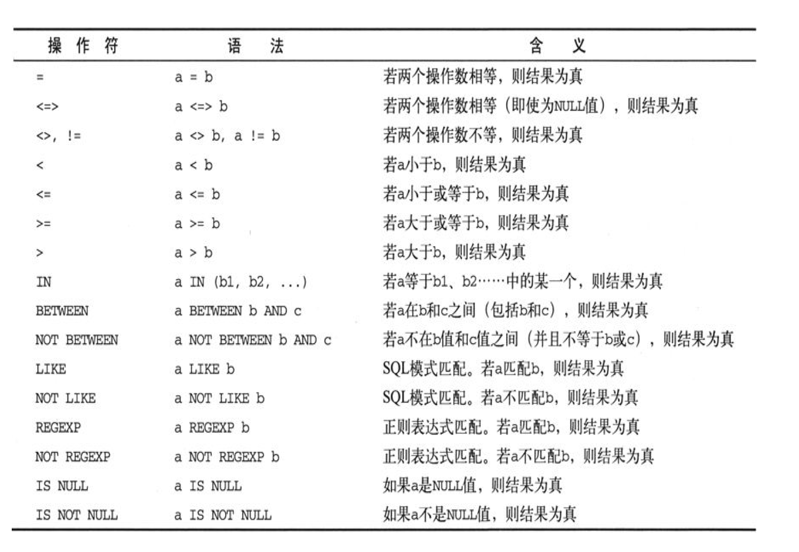
		
		模式匹配不需要你给出精确无误的值就能把数据给检索出来。MySQL提供了两种模式匹配机制：一种叫SQL模式匹配，利用LIKE操作符以及通配符“％”（能与任意个字符序列相匹配）和“_”（只能与一个字符相匹配）匹配；另一种是利用REGEXP操作符和正则表达式匹配，该机制中的规则表达式与grep、sed、vi等UNIX程序所使用的正则表达式非常相似。模式匹配只能使用某种模式匹配操作符才能完成；等号操作符(=)只能用来判断两个数据是否相等，不具备模式匹配能力。与模式匹配概念相对立的“模式不匹配”操作可以用NOT LIKE或NOT REGEXP操作符来完成。
		
		```
		select 'p1804' LIKE 'p%' -->1
		select 'p1804' LIKE 'p_'  -->0
		select 'p1804' LIKE '%18' -->0
		select 'p1804' LIKE '%18%' -->1
		select 'p1804' LIKE '%18\%'
		```
		
		> \表示转义
		
		MySQL还可以使用正则表达式进行匹配，操作符是REGEXP而不是LIKE。
		
	 	1. 句号字符“.”用来匹配任何一种单个字符：

	 		```
	 		select 'p1894' REGEXP 'p.'
	 		```

	 	2. 方括号“［...］”用来匹配在方括号内部出现的任何一种字符：```select 'p' REGEXP '[abcdp]'```
	 	3. 连字符“-”用来给出一个字符范围，只要在字符“-”的两端分别写出这个范围的起始字符和结束字符就行了。如果在这个字符范围的前面再加上一个“^”字符，就可以用它来匹配那些不属于这一范围的字符了，如下所示：
	 	
	 	   ```
	 	       select 'p' REGEXP '[^abcd]'
	 	   
	 	   		select 'p' REGEXP '[a-z]'
	 	    ```
	 	4. 星号字符“＊”匹配“0个或多个在它之前的那个字符”。比如说，模式'x＊'将匹配连续出现的任意个数的'x'字符：
	 	5. ^pattern'和'pattern$'形式的模板将分别匹配以pattern开头或结尾的字符串，而^pattern$'形式的模板将匹配整个字符串是且仅是pattern的情况，

3. 日期/时间值的解释规则

	根据表达式中上下文的要求，MySQL会把字符串和数值自动转换为日期/时间值（或相反）。在数值上下文里，日期/时间值将被自动转换为数值。在日期/时间上下文里，数值将被自动转换为日期/时间值，当你对某个日期/时间数据列赋值或使用了一个需要以日期/时间值为输入参数的函数时，会进行这种转换。在比较操作中，一般规则是把日期/时间值当做一个字符串来比较。
	
	比如说，假设数据表mytbl里有一个名为data_col的DATE数据列，那么下面那几条语句将是等价的
	
	```
	
	insert into test1 set day = '20180421'
	insert into test1 set day = '2018-04-21'	
	```

4. 类型转换

	1. CAST()或CONCAT()函数能够把任何类型的值转换为字符串

		```
		select cast(13 as char)
		
		select concat(13)
		```
		
	2. HEX()函数可以把一个数值转换为一个十六进制串

		```
		select hex(255)
		```
		
	3. ASCII()函数能够把一个单字节字符转换为它的ASCII编码值

		```
		
		select ascii('A')
		```
		
	4. 如果想把ASCII编码反向转换为字符，就需要使用CHAR()函数

		```
		select char(65)
		```
	5. NOW CURTIME()返回时间

		```
		select CURDATE()  -->2018-10-05
		select CURDATE() + 0 --> 20181005
		select NOW() --> 2018-10-05 13:02:08
		select NOW()+0 --> 20181005130223
		```
			

## mysql 三范式(一般知识点,记住即可)

#### 概述

设计关系数据库时，遵从不同的规范要求，设计出合理的关系型数据库，这些不同的规范要求被称为不同的范式，各种范式呈递次规范，越高的范式数据库冗余越小。但是有些时候一昧的追求范式减少冗余，反而会降低数据读写的效率，这个时候就要反范式，利用空间来换时间。

#### 分类

目前关系数据库有六种范式：第一范式（1NF）、第二范式（2NF）、第三范式（3NF）、巴斯-科德范式（BCNF）、第四范式(4NF）和第五范式（5NF，又称完美范式）。满足最低要求的范式是第一范式（1NF）。在第一范式的基础上进一步满足更多规范要求的称为第二范式（2NF），其余范式以次类推。一般说来，数据库只需满足第三范式(3NF）就行了。所以这里就只记录三范式相关的知识。

三范式：

	1NF:字段不可分;
	 
	2NF:有主键，非主键字段依赖主键; 
	
	3NF:非主键字段不能相互依赖; 

解释: 

	1NF:原子性 字段不可再分,否则就不是关系数据库; 
	
	2NF:唯一性 一个表只说明一个事物; 
	
	3NF:每列都与主键有直接关系，不存在传递依赖; 
	
	
#### 第一范式（1NF）

即表的列的具有原子性,不可再分解，即列的信息，不能分解, 只要数据库是关系型数据库(mysql/oracle/db2/informix/sysbase/sql server)，就自动的满足1NF。数据库表的每一列都是不可分割的原子数据项，而不能是集合，数组，记录等非原子数据项。如果实体中的某个属性有多个值时，必须拆分为不同的属性 。通俗理解即一个字段只存储一项信息。


#### 第二范式（2NF）

第二范式（2NF）是在第一范式（1NF）的基础上建立起来的，即满足第二范式（2NF）必须先满足第一范式（1NF）。第二范式（2NF）要求数据库表中的每个实例或行必须可以被惟一地区分。为实现区分通常需要我们设计一个主键来实现(这里的主键不包含业务逻辑)。

即满足第一范式前提，当存在多个主键的时候，才会发生不符合第二范式的情况。比如有两个主键，不能存在这样的属性，它只依赖于其中一个主键，这就是不符合第二范式。通俗理解是任意一个字段都只依赖表中的同一个字段。（涉及到表的拆分）

#### 第三范式（3NF）

满足第三范式（3NF）必须先满足第二范式（2NF）。简而言之，第三范式（3NF）要求一个数据库表中不包含已在其它表中已包含的非主键字段。就是说，表的信息，如果能够被推导出来，就不应该单独的设计一个字段来存放(能尽量外键join就用外键join)。很多时候，我们为了满足第三范式往往会把一张表分成多张表。

即满足第二范式前提，如果某一属性依赖于其他非主键属性，而其他非主键属性又依赖于主键，那么这个属性就是间接依赖于主键，这被称作传递依赖于主属性。 通俗解释就是一张表最多只存两层同类型信息。

#### 反三范式

没有冗余的数据库未必是最好的数据库，有时为了提高运行效率，提高读性能，就必须降低范式标准，适当保留冗余数据。具体做法是： 在概念数据模型设计时遵守第三范式，降低范式标准的工作放到物理数据模型设计时考虑。降低范式就是增加字段，减少了查询时的关联，提高查询效率，因为在数据库的操作中查询的比例要远远大于DML的比例。但是反范式化一定要适度，并且在原本已满足三范式的基础上再做调整的。

