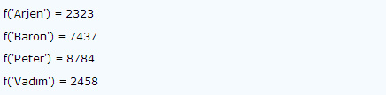
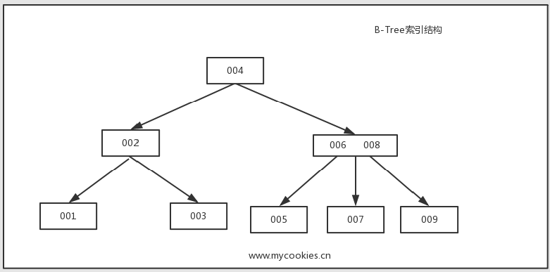
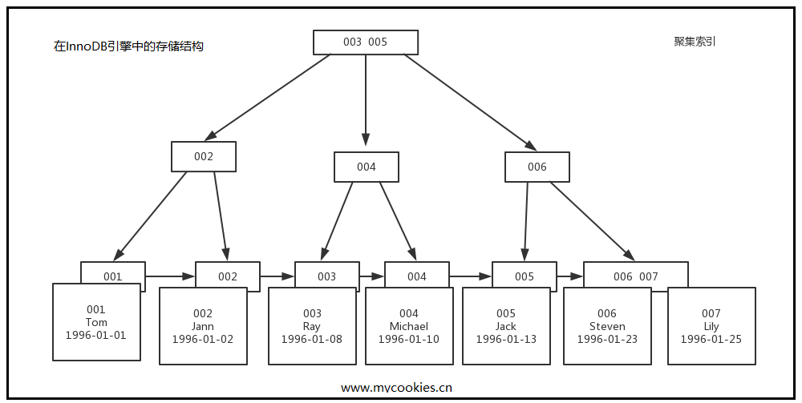
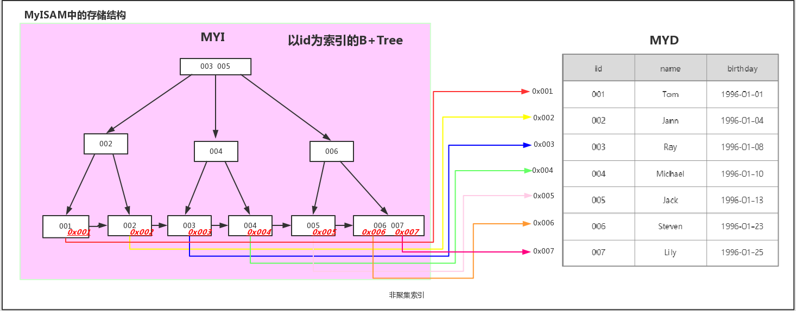

# mysql 索引


## mysql 索引与优化

#### 概述:

索引对查询的速度有着至关重要的影响，理解索引也是进行数据库性能调优的起点。考虑如下情况，假设数据库中一个表有10^6条记录，DBMS的页面大小为4K，并存储100条记录。如果没有索引，查询将对整个表进行扫描，最坏的情况下，如果所有数据页都不在内存，需要读取10^4个页面，如果这10^4个页面在磁盘上随机分布，需要进行10^4次I/O，假设磁盘每次I/O时间为10ms(忽略数据传输时间)，则总共需要100s(但实际上要好很多很多)。如果对之建立B-Tree索引，则只需要进行log100(10^6)=3次页面读取，最坏情况下耗时30ms。这就是索引带来的效果，很多时候，当你的应用程序进行SQL查询速度很慢时，应该想想是否可以建索引。

MySQL官方对索引的定义为：索引（Index）是帮助MySQL高效获取数据的数据结构。提取句子主干，就可以得到索引的本质：索引是数据结构。

我们知道，数据库查询是数据库的最主要功能之一。我们都希望查询数据的速度能尽可能的快，因此数据库系统的设计者会从查询算法的角度进行优化。最基本的查询算法当然是顺序查找（linear search），这种复杂度为O(n)的算法在数据量很大时显然是糟糕的，好在计算机科学的发展提供了很多更优秀的查找算法，例如二分查找（binary search）、二叉树查找（binary tree search）等。如果稍微分析一下会发现，每种查找算法都只能应用于特定的数据结构之上，例如二分查找要求被检索数据有序，而二叉树查找只能应用于二叉查找树上，但是数据本身的组织结构不可能完全满足各种数据结构（例如，理论上不可能同时将两列都按顺序进行组织），所以，在数据之外，数据库系统还维护着满足特定查找算法的数据结构，这些数据结构以某种方式引用（指向）数据，这样就可以在这些数据结构上实现高级查找算法。这种数据结构，就是索引。

看一个例子：

   	
   
图1展示了一种可能的索引方式。左边是数据表，一共有两列七条记录，最左边的是数据记录的物理地址（注意逻辑上相邻的记录在磁盘上也并不是一定物理相邻的）。为了加快Col2的查找，可以维护一个右边所示的二叉查找树，每个节点分别包含索引键值和一个指向对应数据记录物理地址的指针，这样就可以运用二叉查找在O(log2n)的复杂度内获取到相应数据。

虽然这是一个货真价实的索引，但是实际的数据库系统几乎没有使用二叉查找树或其进化品种红黑树（red-black tree）实现的，原因会在下文介绍。
#### 使用索引的优点和缺点和使用原则

1.  优点：

	1. 所有的MySql列类型(字段类型)都可以被索引，也就是可以给任意字段设置索引
	2. 大大加快数据的查询速度

2. 缺点

	1. 创建索引和维护索引要耗费时间，并且随着数据量的增加所耗费的时间也会增加
	2. 索引也需要占空间，我们知道数据表中的数据也会有最大上线设置的，如果我们有大量的索引，索引文件可能会比数据文件更快达到上线值
	3. 当对表中的数据进行增加、删除、修改时，索引也需要动态的维护，降低了数据的维护速度。

3. 使用原则：

	通过上面说的优点和缺点，我们应该可以知道，并不是每个字段度设置索引就好，也不是索引越多越好，而是需要自己合理的使用
	
	1. 对经常更新的表就避免对其进行过多的索引，对经常用于查询的字段应该创建索引
	2. 数据量小的表最好不要使用索引，因为由于数据较少，可能查询全部数据花费的时间比遍历索引的时间还要短，索引就可能不会产生优化效果。
	3. 在一同值少的列上(字段上)不要建立索引，比如在学生表的"性别"字段上只有男，女两个不同值。相反的，在一个字段上不同值较多可是建立索引。

#### 索引的分类

1. 索引的类型 (index_class)

	1. 普通索引： MySQL中基本索引类型，没有什么限制，允许在定义索引的列中插入重复值和空值，纯粹为了查询数据更快一点。

	2. 唯一索引： 索引列中的值必须是唯一的，但是允许为空值
	3. 主键索引： 是一种特殊的唯一索引，不允许有空值
	4. 全文索引: 只能在CHAR,VARCHAR,TEXT类型字段上使用全文索引，介绍了要求，说说什么是全文索引，就是在一堆文字中，通过其中的某个关键字等，就能找到该字段所属的记录行，比如有"好人，二货 ..."
   5. 空间索引: 空间索引是对空间数据类型的字段建立的索引，MySQL中的空间数据类型有四种，GEOMETRY、POINT、LINESTRING、POLYGON。在创建空间索引时，使用SPATIAL关键字。

    
    
    
    
		
2. 从存储数据结构上划分(索引类型) index_type

	索引是在存储引擎中实现的，而不是在服务器层中实现的。所以，每种存储引擎的索引都不一定完全相同，并不是所有的存储引擎都支持所有的索引类型。

	<!--1. FULLTEXT
		即为全文索引。其可以在CREATE TABLE ，ALTER TABLE ，CREATE INDEX 使用，不过目前只有 CHAR、VARCHAR ，TEXT 列上可以创建全文索引。全文索引并不是和MyISAM一起诞生的，它的出现是为了解决WHERE name LIKE “%word%"这类针对文本的模糊查询效率较低的问题。-->

	1. HASH

		由于HASH的唯一（几乎100%的唯一）及类似键值对的形式，很适合作为索引。HASH索引可以一次定位，不需要像树形索引那样逐层查找,因此具有极高的效率。但是，这种高效是有条件的，即只在“=”和“in”条件下高效，对于范围查询、排序及组合索引仍然效率不高
		
		MySQL中，只有Memory存储引擎显示支持hash索引，是Memory表的默认索引类型，尽管Memory表也可以使用B-Tree索引。
		
		假设创建如下一个表：

		```
		CREATE TABLE testhash (
		fname VARCHAR(50) NOT NULL,
		lname VARCHAR(50) NOT NULL,
		KEY USING HASH(fname)
		) ENGINE=MEMORY;
		```
		
		包含的数据如下：
		
		
		
		假设索引使用hash函数f( )，如下：
		
		
		此时，索引的结构大概如下：
		
		
		Slots是有序的，但是记录不是有序的。当你执行
		```mysql> SELECT lname FROM testhash WHERE fname=’Peter’;```
		MySQL会计算’Peter’的hash值，然后通过它来查询索引的行指针。因为f(‘Peter’) = 8784，MySQL会在索引中查找8784，得到指向记录3的指针。
		因为索引自己仅仅存储很短的值，所以，索引非常紧凑。Hash值不取决于列的数据类型，一个TINYINT列的索引与一个长字符串列的索引一样大。
		
		Hash索引有以下一些限制：
		
		(1)由于索引仅包含hash code和记录指针，所以，MySQL不能通过使用索引避免读取记录。但是访问内存中的记录是非常迅速的，不会对性造成太大的影响。
		(2)不能使用hash索引排序。
		(3)Hash索引不支持键的部分匹配，因为是通过整个索引值来计算hash值的。
		(4)Hash索引只支持等值比较，例如使用=，IN( )和<=>。对于WHERE price>100并不能加速查询。
		
		
	2. BTREE

		BTREE索引就是一种将索引值按一定的算法，存入一个树形的数据结构中每次查询都是从树的入口root开始，依次遍历node，获取leaf。这是MySQL里默认和最常用的索引类型。
		
		​ B-Tree能加快数据的访问速度，因为存储引擎不再需要进行全表扫描来获取数据，数据分布在各个节点之中
		​ 
		​ 
		​ 
		​ B+Tree索引是B-Tree的改进版本，同时也是数据库索引索引所采用的存储结构。数据都在叶子节点上，并且增加了顺序访问指针，每个叶子节点都指向相邻的叶子节点的地址。相比B-Tree来说，进行范围查找时只需要查找两个节点，进行遍历即可。而B-Tree需要获取所有节点，相比之下B+Tree效率更高。
		​
		​ 
		​ 
		​ 
		​ myisam和innodb都是使用 btree来实现的
		​
		​ 
		​
	3. 各种引擎支持的类型

		
		
		
	   >上面的类型不能够被用于fulltext索引类型和SPATIAL(空间索引)类型
	   
	   1. fulltext是由引擎来支持的
	   2. SPATIAL 是由 R-Tree(数据结构)支持的
		
3. 单列索引 vs 组合索引　
	
	1. 单列索引：一个索引只包含单个列，但一个表中可以有多个单列索引。 这里不要搞混淆了。

		1. 普通索引: MySQL中基本索引类型，没有什么限制，允许在定义索引的列中插入重复值和空值，纯粹为了查询数据更快一点。
		2. 唯一索引：索引列中的值必须是唯一的，但是允许为空值
		3. 主键索引：是一种特殊的唯一索引，不允许有空值。

	2. 组合索引(复合索引)

		在表中的多个字段组合上创建的索引，只有在查询条件中使用了这些字段的左边字段时，索引才会被使用，使用组合索引时遵循最左前缀集合。
		
		1. 需要加索引的字段，要在where条件中
		2. 数据量少的字段不需要加索引
		3. 如果where条件中是OR关系，加索引不起作用
		4. 符合最左原则
		
		对于复合索引:Mysql从左到右的使用索引中的字段，一个查询可以只使用索引中的一部份，但只能是最左侧部分。例如索引是key index (a,b,c). 可以支持a | a,b| a,b,c 3种组合进行查找，但不支持 b,c进行查找 .当最左侧字段是常量引用时，索引就十分有效。
		

3. 聚簇索引 vs 非聚簇索引
	
	1. 聚簇索引(Clustered Indexes)

		聚簇索引保证关键字的值相近的元组存储的物理位置也相同（所以字符串类型不宜建立聚簇索引，特别是随机字符串，会使得系统进行大量的移动操作），且一个表只能有一个聚簇索引。因为由存储引擎实现索引，所以，并不是所有的引擎都支持聚簇索引。目前，只有solidDB和InnoDB支持。
		
		InnoDB的数据文件本身就是索引文件。从上文知道，MyISAM索引文件和数据文件是分离的，索引文件仅保存数据记录的地址。而在InnoDB中，表数据文件本身就是按B+Tree组织的一个索引结构，这棵树的叶节点data域保存了完整的数据记录。这个索引的key是数据表的主键，因此InnoDB表数据文件本身就是主索引。
		
		
		
		
		图10是InnoDB主索引（同时也是数据文件）的示意图，可以看到叶节点包含了完整的数据记录。这种索引叫做聚集索引。因为InnoDB的数据文件本身要按主键聚集，所以InnoDB要求表必须有主键（MyISAM可以没有），如果没有显式指定，则MySQL系统会自动选择一个可以唯一标识数据记录的列作为主键，如果不存在这种列，则MySQL自动为InnoDB表生成一个隐含字段作为主键，这个字段长度为6个字节，类型为长整形。
		
		
		
	2. 非聚簇索引（二级索引|辅助索引）(non Clustered Indexes)

		
		
		<b>第二个与MyISAM索引的不同是InnoDB的辅助索引data域存储相应记录主键的值而不是地址。</b>
		
		
		
	3. 关键点 聚簇索引数据存在于索引文件中,非聚簇索引只会给出指向数据的指针,然后再去查询。myisam引擎是非聚簇索引，innodb是聚簇索引或者可以选择非聚簇索引

	4. 页分裂:

		1. 为什么会产生页分裂？
			这是因为聚簇索引采用的是平衡二叉树算法，而且每个节点都保存了该主键所对应行的数据，假设插入数据的主键是自增长的，那么根据二叉树算法会很快的把该数据添加到某个节点下，而其他的节点不用动；但是如果插入的是不规则的数据，那么每次插入都会改变二叉树之前的数据状态。从而导致了页分裂。
			
		2. 结论:

			聚簇索引的主键值,应尽量是连续增长的值,而不是要是随机值, (不要用随机字符串或UUID)，否则会造成大量的页分裂与页移动。
		

4. 索引操作命令

	1. 创建索引
			
		```
		   
		   CREATE [UNIQUE | FULLTEXT | SPATIAL] INDEX index_name
		    [index_type]
		    ON tbl_name (key_part,...)
		    [index_option]
		    [algorithm_option | lock_option] ...
		
			key_part:
			    col_name [(length)] [ASC | DESC]
			
			index_option:
			    KEY_BLOCK_SIZE [=] value
			  | index_type
			  | WITH PARSER parser_name
			  | COMMENT 'string'
			
			index_type:
			    USING {BTREE | HASH}
			
			algorithm_option:
			    ALGORITHM [=] {DEFAULT | INPLACE | COPY}
			
			lock_option:
			    LOCK [=] {DEFAULT | NONE | SHARED | EXCLUSIVE}
		   
		```	
		   
		其中对应的语法变量信息如下：
		
		1. [UNIQUE|FULLTEXT|SPATIAL]
		
			中括号中的这三个关键字表示创建的索引类型，它们分别表示唯一索引、全文索引、空间索引三种不同的索引类型。如果我们不指定任何关键字，则默认为普通索引。
			
		2. index_name
		
			index_name表示索引的名称，由用户自行定义，以便于以后对该索引进行修改等管理操作。
			
		3. index_type
			index_type表示索引的具体实现方式，在MySQL中，有两种不同形式的索引——BTREE索引和HASH索引。在存储引擎为MyISAM和InnoDB的表中只能使用BTREE，其默认值就是BTREE；在存储引擎为MEMORY或者HEAP的表中可以使用HASH和BTREE两种类型的索引，其默认值为HASH。
			
		4. index_col_name
		
			index_col_name表示需要创建索引的字段名称，我们还可以针对多个字段创建复合索引，只需要在多个字段名称之间以英文逗号隔开即可。
			
			此外，对于CHAR或VARCHAR类型的字段，我们还可以只使用字段内容前面的一部分来创建索引，只需要在对应的字段名称后面加上形如(length)的指令即可，表示只需要使用字段内容前面的length个字符来创建索引。在这里，我们以User表的username字段(类型为VARCHAR(50))为例，使用username字段的6个字符前缀来创建索引。
			
			```
			CREATE INDEX idx_user_username ON user (username(6));
			```
			
			上述创建索引的语法还具有以下变体：
			
			```
			ALTER TABLE table_name 
			ADD [UNIQUE|FULLTEXT|SPATIAL] INDEX index_name (index_col_name,...) [USING index_type]
			
			```
			
	2. 删除索引

		```
		ALTER TABLE table_name
		DROP INDEX index_name;
		```
		
	3. 修改索引

		在MySQL中并没有提供修改索引的直接指令，一般情况下，我们需要先删除掉原索引，再根据需要创建一个同名的索引，从而变相地实现修改索引操作。

		```
		--先删除
		ALTER TABLE user
		DROP INDEX idx_user_username;
		--再以修改后的内容创建同名索引
		CREATE INDEX idx_user_username ON user (username(8));
		```
		
	4. 查看索引

		```
		--如果查看索引前，没有使用user db_name等命令指定具体的数据库，则必须加上FROM db_name
		SHOW INDEX FROM table_name [FROM db_name]
		--如果查看索引前，没有使用user db_name等命令指定具体的数据库，则必须加上db_name.前缀
		SHOW INDEX FROM [db_name.]table_name
		```
		
参考文章:

1. https://dev.mysql.com/doc/refman/5.7/en/create-index.html

