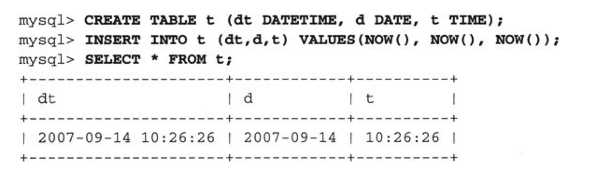

# 概述

#### 概述

1. MySQL支持把几种对象存放在服务器端供以后使用。这几种对象有一些可以根据情况通过程序代码调用，有一些会在数据表被修改时自动执行，还有一些可以在预定时刻自动执行。它们可以分为以下几种。

	1. 存储函数（stored function）。返回一个计算结果，该结果可以用在表达式里。
	2. 存储过程（stored procedure）。不直接返回一个结果，但可以用来完成一般的运算或是生成一个结果集并传递回客户。
	3. 触发器（trigger）。与数据表相关联，当那个数据表被INSERT、DELETE或UPDATE语句修改时，触发器将自动执行。
	4. 事件（event）。根据时间表在预定时刻自动执行。

	
2. 复合语句和语句分隔符

	在使用复合语句时，必须考虑和解决这样一个问题：复合语句块里的语句必须以分号（;）彼此隔开，但因为分号同时也是mysql程序默认使用的语句分隔符，所以在使用mysql程序定义存储程序时会发生冲突。解决这个问题的办法是使用delimiter命令把mysql程序的语句分隔符重定义为另一个字符或字符串，它必须是在存储例程的定义里没有出现过的。这样一来，mysql程序就不会把分号解释为语句终止符了，它将把整个对象定义作为一条语句传递给服务器。在定义完存储程序之后，可以把mysql程序的语句终止符重新定义为分号。下面的例子在定义一个存储过程时把mysql程序的默认分隔符临时改变为$，然后在恢复了mysql程序的默认分隔符之后执行了那个存储过程：
	
	
3. 存储过程

	1. 存储过程和存储函数的区别
	
	    1. 使用存储过程的情况主要有两种：（1）只需通过运算来实现某种效果或动作而无需返回一个值，（2）运算会返回多个结果集（函数做不到这一点）。这只是些指导性建议，不是硬性规定。
	    2. 存储函数要用CREATE FUNCTION语句来创建，存储过程要用CREATE PROCEDURE语句来创建，为了与数据表或数据列的名字有所区别，给参数起名字时将使用p_前缀。
	    
	2. 分隔符,由于mysql默认分隔符是 ; 如果我们使用了;表示存储过程已经结束,但是mysql默认语句也是;结束,如果我们想要在存储过程中多加几个sql语句怎么办？我们需要先修改分割符,然后写sql语句和存储过程然后恢复到默认的分隔符。

	```
	
	mysql> delimiter $
	mysql> create procedure show_born()
	mysql> begin
	mysql> select 1;
	mysql> select 2;
	mysql> end$
	mysql> delimiter ;
	``` 
	
	3. 存储过程的调用
	
		调用存储过程使用call命令调用 比如
		
		```
		call show_born
		```
		
	4. 存储过程参数传入

		```
		create procedure p1 (p_id INT) begin select p_id; end$$
		
		```
		
		```
		
		begin select * from `test1` where test1=p_id; end
		
		```
	
	5. 存储过程的参数类型

		存储过程的参数分为3种类型。对于IN参数，调用者把一个值传递给过程，过程可以对这个值进行修改，但任何修改在过程返回后对调用者是不可见的。OUT参数刚好相反，过程把一个值赋值给OUT参数，这个值在过程返回后可以由调用者访问。INOUT参数允许调用者向过程传递一个值，然后再取回一个值。
		
		要想明确地为参数指定类型，在参数表里把IN、OUT或INOUT写在参数名字前面即可。如果没有为参数指定类型，其默认类型将是IN。
		
		在使用OUT或INOUT参数时，在调用过程时需要给出一个变量名。过程可以设置参数的值，相应的变量将在过程返回时获得那个值。如果想让某个存储过程返回多个结果值，OUT和INOUT参数类型将非常有用（存储函数只能返回一个值，不能胜任）。
		
3. 触发器

	1. 说明:
	
	    触发器是与特定数据表相关联的存储过程，当相应的数据表被INSERT、DELETE或UPDATE语句修改时，触发器将自动执行。触发器可以被设置成在这几种语句处理每个数据行之前或之后触发。触发器的定义包括一条将在触发器被触发时执行的语句。
	
	       1. 触发器可以检查或修改将被插入或用来更新数据行的新数据值。这意味着我们可以利用触发器强制实现数据的完整性，比如检查某个百分比数值是不是落在了0到100的区间内。触发器还可以用来对输入数据进行必要的过滤。

	       2. 触发器可以把表达式的结果赋值给数据列作为其默认值。这使我们可以绕开数据列定义里的默认值必须是常数的限制。
	       3. 触发器可以在删除或修改数据行之前先检查它的当前内容。这种能力可以用来实现许多功能，例如把对现有数据行的修改记载到一个日志里。

	2. 注意事项:
	
	    触发器要用CREATE TRIGGER语句来创建。在触发器的定义里需要表明它将由哪种语句（INSERT、UPDATE或DELETE）触发，是在数据行被修改之前还是之后被触发。 
	    
	    
	    
	    1. tb_name是与触发器相关联的数据表的名字；
	    2. trigger_name是触发器本身的名字。
	    3. trigger_stmt是触发器的语句体部分，也就是在触发器被触发时将要执行的语句。
	    4. 可以使用NEW.col_name语法来引用将由INSERT或UPDATE语句插入或修改的新数据行里的数据列。类似地，OLD.col_name语法可以用来引用将由DELETE或UPDATE语句删除或修改的老数据行里的数据列

	    5. 示例

	    	每次创建新值的时候,新的数据列test2都会变成999

	    	```
	    	create trigger test1_t before insert on test1 for each row begin set NEW.test2=999; end$$ 
	    	
	    	```

	   
4. 事件

    1. 说明:

       1. 我们可以把数据库操作安排在预定时间执行。事件是与一个时间表相关联的存储程序，时间表用来定义事件发生的时间、次数以及何时消失。事件非常适合用来执行各种无人值守的系统管理任务，如定期更新汇总报告、清理过期失效的数据、对日志数据表进行轮转等。
        
     2. 在默认的情况下，事件调度器不会运行。如果你想使用事件，必须先启用事件调度器。把以下语句添加到一个选项文件中（服务器在启动时将读取）：
		[mysqld]
		event_scheduler=ON
	
	  3. 如果你想在系统运行时查看事件调度器的状态，可以使用这条语句： 
		  
		  	show variables like 'event_scheduler'
		  	
		  	如果你想在系统运行时停止或启动事件调度器，可以通过改变event_scheduler系统变量的值来达到目的（它是一个GLOBAL变量，你必须拥有SUPER权限才能修改它）：
		  	
		  	```
		  	mysql> set GLOBAL event_scheduler = ON;
		  	```
		  	
    2. 实际使用

    
    	```
    	mysql> create event e1 on schedule every 5 second do insert into test1 (test1)values('8888');
    	``` 
    	>DO子句负责定义事件的语句体部分
    	
    	如果想创建一个只执行一次的事件，就应该使用AT调度类型而不是EVERY。如下所示的定义将创建一个只执行一次的事件，在一个小时后执行：
    	
    	```
    	
    	mysql> create event e2 on schedule at current_timestamp + interval 5 minute do select 1;
    	```
    	
    	如果你想禁用某个事件，让它不再定期执行，或者重新激活某个已被禁用的事件，请使用ALTER EVENT语句：
    	```
    	alter event e1 disable;
    	alter event e1 enable;
    	```

	  
