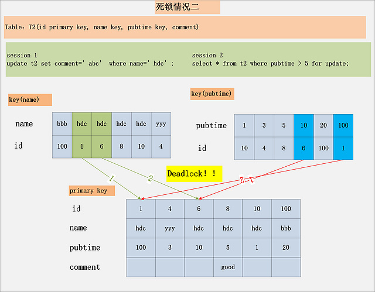

## 锁

#### 概述

数据库锁定机制简单来说，就是数据库为了保证数据的一致性，而使各种共享资源在被并发访问变得有序所设计的一种规则。对于任何一种数据库来说都需要有相应的锁定机制，所以MySQL自然也不能例外。MySQL数据库由于其自身架构的特点，存在多种数据存储引擎，每种存储引擎所针对的应用场景特点都不太一样，为了满足各自特定应用场景的需求，每种存储引擎的锁定机制都是为各自所面对的特定场景而优化设计，所以各存储引擎的锁定机制也有较大区别。

#### 读写锁（重点）

在处理并发的读或者写时,可以通过实现一个由两种类型的锁组成的锁系统来解决上面概述中的问题。这两种锁通常称为共享锁 排它锁,或者叫做读锁,写锁

1. 共享锁：

	对某一资源加共享锁，自身可以读该资源，其他人也可以读该资源（也可以再继续加共享锁，即 共享锁可多个共存），但无法修改。要想修改就必须等所有共享锁都释放完之后。语法为：```select * from table lock in share mode```
	
2. 排他锁

	对某一资源加排他锁，自身可以进行增删改查，其他人无法进行任何操作。语法为：```select * from table for update``` --增删改自动加了排他锁
	
3. 应用

	1. 例1
		T1:
		```select * from table lock in share mode```（假设查询会花很长时间，下面的例子也都这么假设）
		T2:```update table set column1='hello'```
		
		过程：
	T1运行（并加共享锁)
	T2运行
	If T1还没执行完
	T2等......
	else锁被释放
	T2执行
	endif
	
	T2 之所以要等，是因为 T2 在执行 update 前，试图对 table 表加一个排他锁，而数据库规定同一资源上不能同时共存共享锁和排他锁。所以 T2 必须等 T1 执行完，释放了共享锁，才能加上排他锁，然后才能开始执行 update 语句。
	
	2. 例2

		T1:
		```
		select * from table lock in share mode
		```
		T2:
		```
		select * from table lock in share mode
		```
		T3:
		```
		update table set column1='hello'
		```

		T2 不用等 T1 运行完就能运行，T3 却要等 T1 和 T2 都运行完才能运行。因为 T3 必须等 T1 和 T2 的共享锁全部释放才能进行加排他锁然后执行 update 操作。
		
##三级封锁协议(了解)

1. 一级封锁协议：事务T在修改数据R之前必须先对其加X锁，直到事务结束才释放。事务结束包括正常结束（COMMIT）和非正常结束（ROLLBACK）。 一级封锁协议可以防止丢失修改，并保证事务T是可恢复的。使用一级封锁协议可以解决丢失修改问题。在一级封锁协议中，如果仅仅是读数据不对其进行修改，是不需要加锁的，它不能保证可重复读和不读“脏”数据。
2. 二级封锁协议：在一级封锁协议之上，事务T在读取数据R之前必须先对其加S锁，读完后方可释放S锁。 二级封锁协议除防止了丢失修改，还可以进一步防止读“脏”数据。但在二级封锁协议中，由于读完数据后即可释放S锁，所以它不能保证可重复读。
3. 三级封锁协议 ：在一级封锁协议之上，事务T在读取数据R之前必须先对其加S锁，直到事务结束才释放。 三级封锁协议除防止了丢失修改和不读“脏”数据外，还进一步防止了不可重复读。


#### 锁的大小(颗粒度) （重点）

1. 表级锁定（table-level）

	表级别的锁定是MySQL各存储引擎中最大颗粒度的锁定机制。该锁定机制最大的特点是实现逻辑非常简单，带来的系统负面影响最小。所以获取锁和释放锁的速度很快。由于表级锁一次会将整个表锁定，所以可以很好的避免困扰我们的死锁问题。
	
	当然，锁定颗粒度大所带来最大的负面影响就是出现锁定资源争用的概率也会最高，致使并大度大打折扣。
使用表级锁定的主要是MyISAM，MEMORY，CSV等一些非事务性存储引擎。
2. 行级锁定（row-level）

	行级锁定最大的特点就是锁定对象的颗粒度很小，也是目前各大数据库管理软件所实现的锁定颗粒度最小的。由于锁定颗粒度很小，所以发生锁定资源争用的概率也最小，能够给予应用程序尽可能大的并发处理能力而提高一些需要高并发应用系统的整体性能。
	
	虽然能够在并发处理能力上面有较大的优势，但是行级锁定也因此带来了不少弊端。由于锁定资源的颗粒度很小，所以每次获取锁和释放锁需要做的事情也更多，带来的消耗自然也就更大了。此外，行级锁定也最容易发生死锁。
	
	使用行级锁定的主要是InnoDB存储引擎。
3. 页级锁定（page-level）

	页级锁定是MySQL中比较独特的一种锁定级别，在其他数据库管理软件中也并不是太常见。页级锁定的特点是锁定颗粒度介于行级锁定与表级锁之间，所以获取锁定所需要的资源开销，以及所能提供的并发处理能力也同样是介于上面二者之间。另外，页级锁定和行级锁定一样，会发生死锁。

	在数据库实现资源锁定的过程中，随着锁定资源颗粒度的减小，锁定相同数据量的数据所需要消耗的内存数量是越来越多的，实现算法也会越来越复杂。不过，随着锁定资源颗粒度的减小，应用程序的访问请求遇到锁等待的可能性也会随之降低，系统整体并发度也随之提升。
使用页级锁定的主要是BerkeleyDB存储引擎。

4. 总的来说，MySQL这3种锁的特性可大致归纳如下：

	表级锁：开销小，加锁快；不会出现死锁；锁定粒度大，发生锁冲突的概率最高，并发度最低；
行级锁：开销大，加锁慢；会出现死锁；锁定粒度最小，发生锁冲突的概率最低，并发度也最高；    

	页面锁：开销和加锁时间界于表锁和行锁之间；会出现死锁；锁定粒度界于表锁和行锁之间，并发度一般。
适用：从锁的角度来说，表级锁更适合于以查询为主，只有少量按索引条件更新数据的应用，如Web应用；

	而行级锁则更适合于有大量按索引条件并发更新少量不同数据，同时又有并发查询的应用，如一些在线事务处理（OLTP）系统。
	
	


#### myisam的锁 （部分重点）

由于MyISAM存储引擎使用的锁定机制完全是由MySQL提供的表级锁定实现，所以下面我们将以MyISAM存储引擎作为示例存储引擎。

1. MySQL表级锁的锁模式（重点）

	MySQL的表级锁有两种模式：表共享读锁（Table Read Lock）和表独占写锁（Table Write Lock）。锁模式的兼容性：
	
	对MyISAM表的读操作，不会阻塞其他用户对同一表的读请求，但会阻塞对同一表的写请求；
	
	对MyISAM表的写操作，则会阻塞其他用户对同一表的读和写操作；
	
	MyISAM表的读操作与写操作之间，以及写操作之间是串行的。当一个线程获得对一个表的写锁后，只有持有锁的线程可以对表进行更新操作。其他线程的读、写操作都会等待，直到锁被释放为止。
	
2. myisam的锁

	MySQL的表级锁有两种模式：表共享读锁（Table Read Lock）和表独占写锁（Table Write Lock）。锁模式的兼容性：
	
	对MyISAM表的读操作，不会阻塞其他用户对同一表的读请求，但会阻塞对同一表的写请求；
对MyISAM表的写操作，则会阻塞其他用户对同一表的读和写操作；

	MyISAM表的读操作与写操作之间，以及写操作之间是串行的。当一个线程获得对一个表的写锁后，只有持有锁的线程可以对表进行更新操作。其他线程的读、写操作都会等待，直到锁被释放为止。
	
3. 如何加表锁

	MyISAM在执行查询语句（SELECT）前，会自动给涉及的所有表加读锁，在执行更新操作（UPDATE、DELETE、INSERT等）前，会自动给涉及的表加写锁，这个过程并不需要用户干预，因此，用户一般不需要直接用LOCK TABLE命令给MyISAM表显式加锁。
	
<!--3. MyISAM表锁优化建议
	对于MyISAM存储引擎，虽然使用表级锁定在锁定实现的过程中比实现行级锁定或者页级锁所带来的附加成本都要小，锁定本身所消耗的资源也是最少。但是由于锁定的颗粒度比较到，所以造成锁定资源的争用情况也会比其他的锁定级别都要多，从而在较大程度上会降低并发处理能力。所以，在优化MyISAM存储引擎锁定问题的时候，最关键的就是如何让其提高并发度。由于锁定级别是不可能改变的了，所以我们首先需要尽可能让锁定的时间变短，然后就是让可能并发进行的操作尽可能的并发。
	
	1. 查询表级锁争用情况

		```
		
		mysql root@localhost:(none)> show status like 'table_lock%'
		+-----------------------+-------+
		| Variable_name         | Value |
		+-----------------------+-------+
		| Table_locks_immediate | 101   |
		| Table_locks_waited    | 0     |
		+-----------------------+-------+
		
		```
		
		这里有两个状态变量记录MySQL内部表级锁定的情况，两个变量说明如下：
Table_locks_immediate：产生表级锁定的次数；
Table_locks_waited：出现表级锁定争用而发生等待的次数；
两个状态值都是从系统启动后开始记录，出现一次对应的事件则数量加1。如果这里的Table_locks_waited状态值比较高，那么说明系统中表级锁定争用现象比较严重，就需要进一步分析为什么会有较多的锁定资源争用了。

	2. 缩短锁定时间

	    如何让锁定时间尽可能的短呢？唯一的办法就是让我们的Query执行时间尽可能的短。
	   1. 尽两减少大的复杂Query，将复杂Query分拆成几个小的Query分布进行；
      2. 尽可能的建立足够高效的索引，让数据检索更迅速；
      3. 尽量让MyISAM存储引擎的表只存放必要的信息，控制字段类型；
      4. 利用合适的机会优化MyISAM表数据文件。

   
   3. 分离能并行的操作-->

   		
   		
   		
#### innodb的锁（重点）

行级锁定不是MySQL自己实现的锁定方式，而是由其他存储引擎自己所实现的，如广为大家所知的InnoDB存储引擎，以及MySQL的分布式存储引擎NDBCluster等都是实现了行级锁定。考虑到行级锁定君由各个存储引擎自行实现，而且具体实现也各有差别，而InnoDB是目前事务型存储引擎中使用最为广泛的存储引擎，所以这里我们就主要分析一下InnoDB的锁定特性。

1. InnoDB锁定模式及实现机制

	考虑到行级锁定均由各个存储引擎自行实现，而且具体实现也各有差别，而InnoDB是目前事务型存储引擎中使用最为广泛的存储引擎，所以这里我们就主要分析一下InnoDB的锁定特性。
	
	总的来说，InnoDB的锁定机制和Oracle数据库有不少相似之处。InnoDB的行级锁定同样分为两种类型，共享锁和排他锁，而在锁定机制的实现过程中为了让行级锁定和表级锁定共存，InnoDB也同样使用了意向锁（表级锁定）的概念，也就有了意向共享锁和意向排他锁这两种。
	
	当一个事务需要给自己需要的某个资源加锁的时候，如果遇到一个共享锁正锁定着自己需要的资源的时候，自己可以再加一个共享锁，不过不能加排他锁。但是，如果遇到自己需要锁定的资源已经被一个排他锁占有之后，则只能等待该锁定释放资源之后自己才能获取锁定资源并添加自己的锁定。而意向锁的作用就是当一个事务在需要获取资源锁定的时候，如果遇到自己需要的资源已经被排他锁占用的时候，该事务可以需要锁定行的表上面添加一个合适的意向锁。如果自己需要一个共享锁，那么就在表上面添加一个意向共享锁。而如果自己需要的是某行（或者某些行）上面添加一个排他锁的话，则先在表上面添加一个意向排他锁。意向共享锁可以同时并存多个，但是意向排他锁同时只能有一个存在。所以，可以说InnoDB的锁定模式实际上可以分为四种：

   1. 共享锁（S），
   2. 排他锁（X），
   3. 意向共享锁（IS）
   4. 意向排他锁（IX），
	
	我们可以通过以下表格来总结上面这四种所的共存逻辑关系：
	
	
	
	>如果一个事务请求的锁模式与当前的锁兼容，InnoDB就将请求的锁授予该事务；反之，如果两者不兼容，该事务就要等待锁释放。
	
	意向锁是InnoDB自动加的，不需用户干预。对于UPDATE、DELETE和INSERT语句，InnoDB会自动给涉及数据集加排他锁（X)；对于普通SELECT语句，InnoDB不会加任何锁；事务可以通过以下语句显示给记录集加共享锁或排他锁。
	
	```
	共享锁（S）：SELECT * FROM table_name WHERE ... LOCK IN SHARE MODE
	排他锁（X)：SELECT * FROM table_name WHERE ... FOR UPDATE
	```
	
	>用SELECT ... IN SHARE MODE获得共享锁，主要用在需要数据依存关系时来确认某行记录是否存在，并确保没有人对这个记录进行UPDATE或者DELETE操作。
但是如果当前事务也需要对该记录进行更新操作，则很有可能造成死锁，对于锁定行记录后需要进行更新操作的应用，应该使用SELECT... FOR UPDATE方式获得排他锁。

2. InnoDB行锁实现方式
	<b>InnoDB行锁是通过给索引上的索引项加锁来实现的</b>，只有通过索引条件检索数据，InnoDB才使用行级锁，否则，InnoDB将使用表锁
	
   1. 在不通过索引条件查询的时候，InnoDB确实使用的是表锁，而不是行锁。
   2. 由于MySQL的行锁是针对索引加的锁，不是针对记录加的锁，所以虽然是访问不同行的记录，但是如果是使用相同的索引键，是会出现锁冲突的。
   3. 当表有多个索引的时候，不同的事务可以使用不同的索引锁定不同的行，另外，不论是使用主键索引、唯一索引或普通索引，InnoDB都会使用行锁来对数据加锁。
   4. 即便在条件中使用了索引字段，但是否使用索引来检索数据是由MySQL通过判断不同执行计划的代价来决定的，如果MySQL认为全表扫描效率更高，比如对一些很小的表，它就不会使用索引，这种情况下InnoDB将使用表锁，而不是行锁。因此，在分析锁冲突时，别忘了检查SQL的执行计划，以确认是否真正使用了索引


##乐观锁 vs 悲观锁（重点）

1. 乐观锁

	总是认为不会产生并发问题，每次去取数据的时候总认为不会有其他线程对数据进行修改，因此不会上锁，但是在更新时会判断其他线程在这之前有没有对数据进行修改，一般会使用版本号机制或CAS操作实现。

	version方式：一般是在数据表中加上一个数据版本号version字段，表示数据被修改的次数，当数据被修改时，version值会加一。当线程A要更新数据值时，在读取数据的同时也会读取version值，在提交更新时，若刚才读取到的version值为当前数据库中的version值相等时才更新，否则重试更新操作，直到更新成功。
	
	```
	update table set x=x+1, version=version+1 where id=#{id} and version=#{version};  

	```
	
	CAS操作方式：即compare and swap 或者 compare and set，涉及到三个操作数，数据所在的内存值，预期值，新值。当需要更新时，判断当前内存值与之前取到的值是否相等，若相等，则用新值更新，若失败则重试，一般情况下是一个自旋操作，即不断的重试。


共享锁和排它锁就是悲观锁的子类

2. 悲观锁

	总是假设最坏的情况，每次取数据时都认为其他线程会修改，所以都会加锁（读锁、写锁、行锁等），当其他线程想要访问数据时，都需要阻塞挂起。可以依靠数据库实现，如行锁、读锁和写锁等，都是在操作之前加锁.
	所以说我们上面所说的读锁,写锁都是属于悲观锁
	
3. 优缺点

	两种锁各有优缺点，不可认为一种好于另一种，像乐观锁适用于写比较少的情况下，即冲突真的很少发生的时候，这样可以省去了锁的开销，加大了系统的整个吞吐量。但如果经常产生冲突，上层应用会不断的进行retry，这样反倒是降低了性能，所以这种情况下用悲观锁就比较合适。
	

## gap vs 	Record lock

1. Gap lock 间隙锁
在索引记录之间的间隙中加锁，或者是在某一条索引记录之前或者之后加锁，并不包括该索引记录本身。gap lock的机制主要是解决可重复读模式下的幻读问题，关于幻读的演示和gap锁如何解决了幻读

    当我们用范围条件而不是相等条件检索数据，并请求共享或排他锁时，InnoDB会给符合条件的已有数据记录的索引项加锁；
	
	对于键值在条件范围内但并不存在的记录，叫做“间隙（GAP)”，InnoDB也会对这个“间隙”加锁，这种锁机制就是所谓的间隙锁（Next-Key锁）。
	
	例：
	假如emp表中只有101条记录，其empid的值分别是 1,2,...,100,101，下面的SQL：
	
	```
	mysql> select * from emp where empid > 100 for update;
	```
	
	>是一个范围条件的检索，InnoDB不仅会对符合条件的empid值为101的记录加锁，也会对empid大于101（这些记录并不存在）的“间隙”加锁。
	
	InnoDB使用间隙锁的目的：
防止幻读，以满足相关隔离级别的要求。对于上面的例子，要是不使用间隙锁，如果其他事务插入了empid大于100的任何记录，那么本事务如果再次执行上述语句，就会发生幻读；

2. Record lock
单条索引记录上加锁，record lock锁住的永远是索引，而非记录本身，即使该表上没有任何索引，那么innodb会在后台创建一个隐藏的聚集主键索引，那么锁住的就是这个隐藏的聚集主键索引。所以说当一条sql没有走任何索引时，那么将会在每一条聚集索引后面加X锁，这个类似于表锁，但原理上和表锁应该是完全不同的。


3. Next-Key

	就是Record lock和gap lock的结合，即除了锁住记录本身，还要再锁住索引之间的间隙。
	
4. 总结:

	我们这里所说的,是加锁的范围,所以gap锁可以使共享锁也可以是排它锁
	
	
#### 死锁

1. 概述

	所谓死锁DeadLock: 是指两个或两个以上的进程在执行过程中,因争夺资源而造成的一种互相等待的现象,若无外力作用,它们都将无法推进下去.此时称系统处于死锁状态或系统产生了死锁,这些永远在互相等带的进程称为死锁进程.表级锁不会产生死锁.所以解决死锁主要还是针对于最常用的InnoDB.
	
	>死锁的关键在于：两个(或以上)的Session加锁的顺序不一致。那么对应的解决死锁问题的关键就是：让不同的session加锁有次序
	
2. 一些常见的死锁案例

	1. 事务1：update ... where id=1
update ... where id=2

		事务2：update ... where id=2
		udpate ... where id=1
		
		> 如果凑巧，事务1,2都执行完自己的第一条update语句，同时也锁定该行数据，进入第二条，这时发现都有上锁，那么就会彼此等待，这时候就会死锁。
		
	2. 

		>虽然每个Session都只有一条语句，仍旧会产生死锁。要分析这个死锁，首先必须用到本文前面提到的MySQL加锁的规则。针对Session 1，从name索引出发，读到的[hdc, 1]，[hdc, 6]均满足条件，不仅会加name索引上的记录X锁，而且会加聚簇索引上的记录X锁，加锁顺序为先[1,hdc,100]，后[6,hdc,10]。而Session 2，从pubtime索引出发，[10,6],[100,1]均满足过滤条件，同样也会加聚簇索引上的记录X锁，加锁顺序为[6,hdc,10]，后[1,hdc,100]。发现没有，跟Session 1的加锁顺序正好相反，如果两个Session恰好都持有了第一把锁，请求加第二把锁，死锁就发生了。
		
		
	3. 结论：死锁的发生与否，并不在于事务中有多少条SQL语句，死锁的关键在于：两个(或以上)的Session加锁的顺序不一致。而使用本文上面提到的，分析MySQL每条SQL语句的加锁规则，分析出每条语句的加锁顺序，然后检查多个并发SQL间是否存在以相反的顺序加锁的情况，就可以分析出各种潜在的死锁情况，也可以分析出线上死锁发生的原因。


## 如何加锁

```
select .. from  
```
>不加任何类型的锁

```
select...from lock in share mode
```

```
select...from lock for update
```
>排它锁

```
update..where   delete from..where 
```

>排他锁